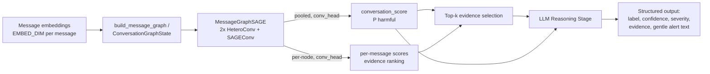

# Harm Pattern Recognition Assistant — Architecture

Real-time system that flags cyberbullying/grooming/scam patterns in
code-mixed conversations. Each message becomes a node in a per-conversation
graph; a GraphSAGE GNN message-passes over that graph and produces a single
conversation-level binary prediction (harmful/safe), which feeds an LLM
stage that turns the score into a short, human-readable explanation.

This module scores a conversation as a whole, using everything observed so
far. There is no separate per-message "live as of now" output — see
[Two call paths](#two-call-paths) for how "as of now" scoring still works
in production.

## Pipeline overview



Code: [`gnn/conversation_gnn.py`](../gnn/conversation_gnn.py) (graph
construction + model), [`gnn/llm_stage.py`](../gnn/llm_stage.py) (LLM
stage), [`gnn/config.py`](../gnn/config.py) (shared constants),
[`main.py`](../main.py) (end-to-end demo).

## Message graph construction

Nodes are individual messages — their raw embeddings, unmodified (the
`EMBED_DIM`-per-message seam where a real sentence-embedding model plugs
in, e.g. XLM-R, LionGuard 2, SEA-LION, SingBERT — not implemented here).

Three **directed** relation types connect them, every edge pointing from an
**earlier** message to a **later** one, never the reverse:

| Relation | Edge | Encodes | Maps to schema |
|---|---|---|---|
| `temporal` | message *i* → *i+1* | conversation order | array position |
| `same_speaker` | last `SAME_SPEAKER_WINDOW` same-sender messages → message *i* | turn-taking / escalation pattern | `sender_id` |
| `reply_to` | parent → reply | explicit threading | `reply_to_message_id` |

`same_speaker` is capped to each message's last `SAME_SPEAKER_WINDOW`
same-sender predecessors (not a full growing history) so per-message cost
stays bounded even for a very chatty sender in a long-running conversation.

**Why directed, not bidirectional.** With bidirectional edges and 2-layer
message passing, appending one new node can change the computed embedding
of every node within 2 hops of it (they'd have a new neighbor) — which
would force a full-graph recompute on every incoming message. With
forward-only edges, a node's embedding depends only on nodes that already
existed when it arrived, so once computed it is never invalidated by
anything appended afterward. That property is what makes real-time
incremental extension both correct and cheap (see below) — it replaces the
old design's transformer causal mask, which existed for a different reason
(protecting a per-message live output) but served a similar purpose
(bounding what a node is allowed to "see").

A 1-message conversation has zero possible edges of any relation — handled
via zero-size edge_index tensors (`[2, 0]`), which `HeteroConv`/`SAGEConv`
accept fine, falling back to each node's own (root) transform only.

## GraphSAGE model — `MessageGraphSAGE`

`input_proj` (`Linear(EMBED_DIM, HIDDEN_DIM)`) → 2 layers of
`HeteroConv({temporal, same_speaker, reply_to}: SAGEConv, aggr='mean')` +
ReLU → a single bare `Linear(HIDDEN_DIM, 1)` `conv_head`.

No positional embedding table (message order is now structural, via
`temporal` edges) and no sender embedding table (identity is structural,
via `same_speaker` edges) — both replace what a sequence model would
otherwise need a learned lookup table for.

## Evidence-score derivation

`conv_head` is deliberately a **bare** `Linear`, not a 2-layer MLP. Pooling
is a plain arithmetic mean over final-layer node embeddings, and `Linear`
is affine, so:

```
conv_head(mean_i(h_i)) == mean_i(conv_head(h_i))     (exact equality)
```

mean distributes over an affine map. That means the *same* `conv_head`
weights, applied to individual node embeddings before pooling, yield a
per-message logit that is an exact additive decomposition of the
conversation-level logit — a principled per-message "contribution to the
verdict" score with **zero extra trained parameters**, used for top-k
evidence selection. It also makes the incremental path's pooling an O(1)
running-sum update instead of an O(n) re-sum every message. (This identity
breaks if `conv_head` ever grows a hidden layer + nonlinearity — keep it a
bare `Linear`.)

These per-message scores are a ranking/responsibility signal, not an
independently-calibrated probability that a message alone is harmful — the
LLM prompt frames them as "score," not "probability."

## Two call paths

One set of trained weights (`MessageGraphSAGE`), two ways to drive them —
no train/serve skew:

- **`build_message_graph(messages)` + `model.forward_full(data)`** — cold
  start / batch. Given a complete message list, builds the full directed
  graph in one shot and runs both GraphSAGE layers over the whole thing.
  Used to score a conversation you're seeing in full for the first time
  (backfill, offline eval, or the demo in `main.py`).

- **`ConversationGraphState` + `state.add_message(...)`** — live /
  production. Caches every message's per-layer hidden state
  (`layer0`/`layer1`/`final`) as it's processed. On each new message:
  resolve its (bounded) causal neighbors from those caches, run one local
  `SAGEConv` step per GraphSAGE layer over just that small neighborhood,
  append the result to the caches, update the running sum for pooling.
  Earlier nodes are never revisited or recomputed — this is what "extend
  the graph, run message passing" means in production. Cost per message is
  bounded by the local neighborhood size (≤ `SAME_SPEAKER_WINDOW` + 2), not
  by conversation length.

`main.py`'s demo runs both paths on the same conversations and confirms
their final `conv_score` matches, as a cheap correctness check that the
incremental math is actually equivalent to the full-graph computation.

## LLM reasoning stage

[`gnn/llm_stage.py`](../gnn/llm_stage.py)'s `run_llm_reasoning(conversation_id,
evidence_messages, conversation_score)` calls a small/fast model
(`LLM_MODEL` in `config.py`) with only: the conversation ID, the single
conversation-level score, and the top-`TOP_K_EVIDENCE` evidence messages
with their contribution scores — never the raw conversation or model
internals. Output is a fixed JSON shape: `conversation_label` (one of
`CONV_LABELS`), `conversation_confidence`, `severity`, `top_evidence_messages`
(with free-text LLM-authored tags), and a short `gentle_alert_text` for
direct display to the user.

## Design rationale

- **Binary, conversation-level output, not 4-class multi-label.**
  `conv_head`'s single sigmoid output maps directly onto the canonical
  `binary_conversation_label` schema field, a cleaner target than a 4-class
  head loosely mapped onto `conversation_label`.
- **Message-level graph, not a cross-conversation graph.** An earlier
  design used a transformer for within-conversation modeling and a separate
  GNN over `user`/`conversation` nodes across *multiple* conversations to
  catch cross-conversation patterns. That cross-conversation layer has been
  cut: this module is scoped to a single conversation's messages only, in
  exchange for the real-time-incremental property above and a simpler,
  single-trained-head design.
- **These 3 edge types** (`temporal`, `same_speaker`, `reply_to`) were
  chosen because they map directly onto fields that already exist in the
  canonical data schema (array order, `sender_id`, `reply_to_message_id`),
  need no extra labeling, and were the project's original pre-architecture
  recommendation.
- **The LLM stage stays prompt-only** over pre-scored, pre-selected
  evidence — no fine-tuned reasoning/tagging head, no raw conversation in
  the prompt — to keep the call cheap and fast regardless of conversation
  length.

## Known limitations

- **Everything is currently untrained** (random init). The demo in
  [`main.py`](../main.py) verifies data-flow/shapes and streaming/batch
  equivalence, not prediction quality.
- **Labeled data is the real bottleneck**, not model architecture — see
  `PROJECT_CONTEXT.md` for the broader data-scarcity discussion.
- **No cross-conversation modeling in this version.** A user running the
  same pattern across separate conversations with different people is not
  currently caught — each conversation is scored independently.
- **`same_speaker` window cap (`SAME_SPEAKER_WINDOW`)** trades a small
  amount of long-range same-sender signal for bounded per-message cost;
  revisit if evaluation shows this loses meaningful signal.
- **No TGN-style persistent memory module.** The incremental path here
  caches hidden states per conversation, not a compressed cross-event
  memory — a true streaming architecture with memory (e.g. TGN) is heavier
  engineering effort than this scope calls for; full recompute via
  `forward_full` remains the fallback for a cold-started long history.

## Related docs

- [`preprocessing_doc.md`](preprocessing_doc.md) — what the preprocessing
  pipeline (`preprocess/`) does to raw message text before it reaches the
  embedding step above. A separate, unrelated spec — not covered by this doc.
