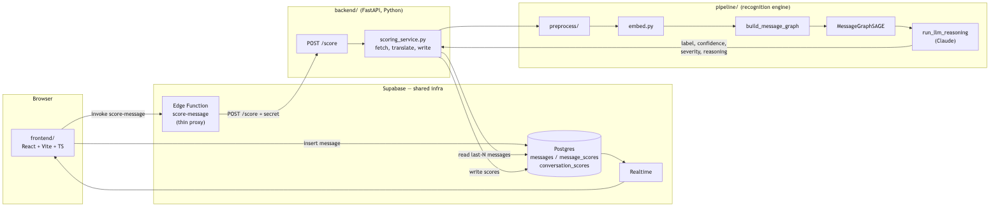
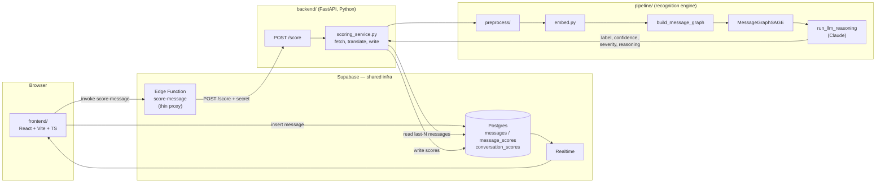
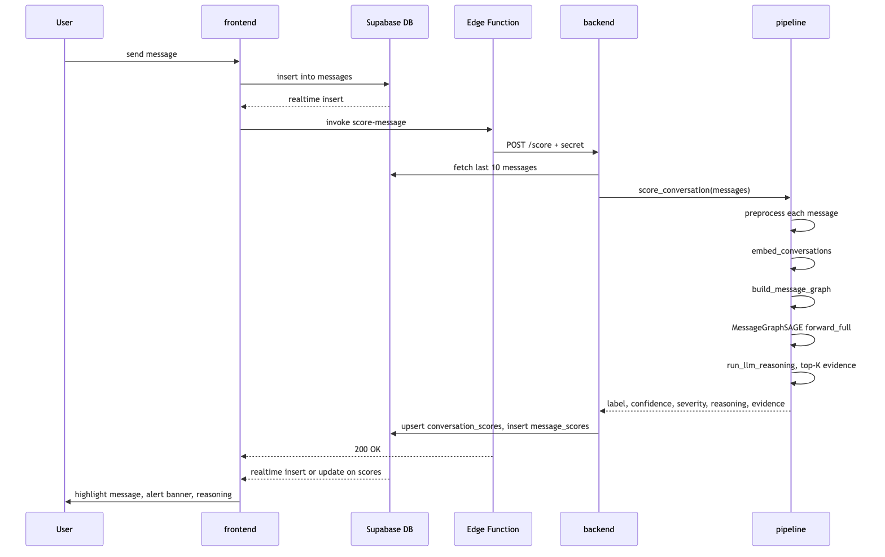
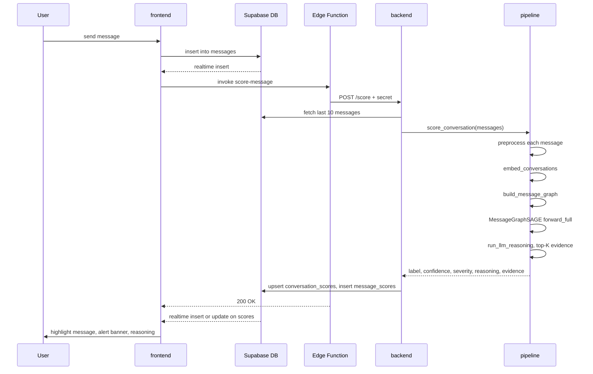

# Architecture

How `frontend/`, `backend/`, and `pipeline/` fit together, and why they're split the way they are. See the root [README.md](../README.md) for a quick start, and [backend.md](backend.md) / [pipeline.md](pipeline.md) / [frontend.md](frontend.md) for the detail behind each piece.

## Component view





**Separation of concern, in one line each:**

- **`frontend/`** — UI only. Talks to Supabase directly for auth/messages/Realtime; talks to the Edge Function to *trigger* scoring; never talks to the backend directly, never knows the pipeline exists.
- **`backend/`** — HTTP interface + Supabase I/O + contract translation. No preprocessing/model/prompt logic of its own — it *calls* `pipeline/`.
- **`pipeline/`** — pure recognition logic. Takes a list of message dicts in, returns a structured verdict out. No HTTP, no Supabase, no framework dependency. The same functions are usable from a notebook, a CLI, or the backend.
- **`supabase/`** — shared schema (migrations) + the one piece of glue (the proxy Edge Function) both sides touch.

## Why `pipeline/` is a sibling of `backend/`, not `backend/pipeline/`

`backend/` is a delivery mechanism (HTTP + Supabase I/O + field-name translation); `pipeline/` is the domain logic (preprocess/embed/graph/GNN/LLM). Nesting one inside the other would blur that line:

1. **Dependency weight** — `pipeline/` needs `torch`/`torch_geometric`/`sentence-transformers` (heavy, GPU-relevant); `backend/` only needs `fastapi`/`uvicorn`/`supabase`. Retraining the model shouldn't require installing FastAPI.
2. **Different lifecycle** — `pipeline/train.py`, `embed.py`, `scripts/make_data_splits.py`, `scripts/anonymize_dataset.py` are standalone CLI workflows with nothing to do with serving a live request, and work exactly as before.
3. **Swap-ability** — as long as `pipeline/inference.py` keeps its function signature, the model architecture, embedding model, or LLM vendor can change without touching a line of `backend/`. That's only a clean boundary if they're siblings, not parent/child.

This also happens to be exactly what's needed to host `frontend/` and `backend/` on separate platforms later (Vercel + Render) with zero restructuring — see [backend.md](backend.md#deployment)'s deployment section.

## Request flow — one message, end to end





The send is never blocked on scoring: the message appears via Realtime immediately, and the flag + reasoning arrive a few seconds later over the same Realtime channel once the pipeline finishes.

## Call chain — concrete file-to-file hops

```
frontend/index.html
  → frontend/src/main.tsx                          (boots React app)
  → frontend/src/pages/ChatPage.tsx
  → frontend/src/components/ChatPane.tsx            (composer + send button)

  On send, frontend/src/hooks/useMessages.ts does TWO things:
    (a) supabase.from('messages').insert(...)        -> straight to Supabase Postgres
    (b) supabase.functions.invoke('score-message')    -> Supabase Edge Function

supabase/functions/score-message/index.ts             (thin proxy)
  -> checks auth + conversation membership
  -> fetch(`${BACKEND_URL}/score`, { conversation_id })

backend/app/main.py                                    (FastAPI app; model loaded once at startup)
  -> backend/app/api/routes/score.py                    POST /score handler
  -> backend/app/services/scoring_service.py
      -> backend/app/core/supabase_client.py             fetch last 10 messages (service role)
      -> backend/app/services/message_mapper.py          translate Supabase row shape -> pipeline shape
      -> backend/app/services/embedding_store.py         attach embeddings (cached where possible)

      -> pipeline/inference.py :: score_conversation(conversation_id, messages, model)   <- THE handoff
          -> pipeline/preprocess/pipeline.py :: preprocess_message()   (per message, inside embed_conversations)
          -> pipeline/embed.py :: embed_conversations()
          -> pipeline/gnn/conversation_gnn.py :: build_message_graph()
          -> pipeline/gnn/conversation_gnn.py :: MessageGraphSAGE.forward_full()
          -> pipeline/gnn/llm_stage.py :: run_llm_reasoning()           (Claude call)
          <- returns {conversation_label, conversation_confidence, severity, top_evidence_messages[], gentle_alert_text}

      <- scoring_service.py translates result -> writes conversation_scores + message_scores
        (service role, back to Supabase Postgres)

supabase/functions/score-message/index.ts  <- returns 200 (frontend already moved on -- fire and forget)

Supabase Realtime pushes INSERT/UPDATE on message_scores / conversation_scores
  -> frontend/src/hooks/useScores.ts
  -> frontend/src/components/AlertPanel.tsx              renders flag + reasoning
```

## Graph storage & lifecycle

Two different things persist, and only one of them is ever written to disk:

- **Model weights** — `pipeline/checkpoints/message_graph_sage.pt`, committed to git (a few MB). This is the only trained artifact.
- **Message embeddings (graph nodes)** — the expensive-to-compute part (a `sentence-transformers` forward pass per message). Cached by `backend/app/services/embedding_store.py`'s `LocalEmbeddingStore` (SQLite, keyed by `message_id` + `model_version`), so a message is only ever embedded once, not once per score request.

**The graph structure itself (nodes + edges as a `HeteroData` object) is never persisted.** `build_message_graph()` rebuilds the temporal/same_speaker/reply_to edges fresh from message metadata (order, `sender_id`, `reply_to_message_id`) on every `/score` call, then discards the graph right after the forward pass. This is deliberate, not an oversight: edges are cheap pure-Python bookkeeping over a small window (≤10 messages), so caching them isn't worth the complexity — only the embeddings (nodes) are worth caching.

`gnn/conversation_gnn.py` also has a `ConversationGraphState` class designed for true incremental scoring (cache per-layer hidden states, extend the graph one message at a time instead of rebuilding). It isn't wired into `backend/` yet — `pipeline/inference.py` uses the simpler `build_message_graph()` + `forward_full()` (cold-start/batch) path, which is correct and cheap enough given the small window size. `ConversationGraphState` remains available as a future optimization if the window ever grows large enough that rebuilding becomes expensive.

See [backend.md](backend.md#deployment) for the scaling caveat this implies (the local SQLite cache doesn't survive horizontal scaling).
