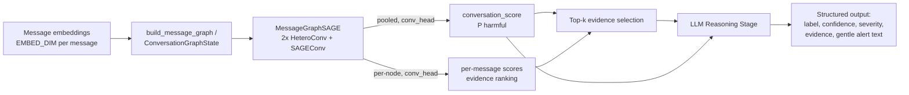

# Pipeline — recognition engine

Real-time system that flags cyberbullying/grooming/scam patterns in code-mixed conversations. Each message becomes a node in a per-conversation graph; a GraphSAGE GNN message-passes over that graph and produces a single conversation-level binary prediction (harmful/safe), which feeds an LLM stage that turns the score into a short, human-readable explanation.

`pipeline/` has no HTTP or Supabase knowledge — see [backend.md](backend.md) for how `backend/` fetches messages and calls into this, and [architecture.md](architecture.md) for the full system view.

This module scores a conversation as a whole, using everything observed so far. There is no separate per-message "live as of now" output — see [Two call paths](#two-call-paths) for how "as of now" scoring still works in production.

## Pipeline overview



Code: [`gnn/conversation_gnn.py`](../pipeline/gnn/conversation_gnn.py) (graph construction + model), [`gnn/llm_stage.py`](../pipeline/gnn/llm_stage.py) (LLM stage), [`gnn/config.py`](../pipeline/gnn/config.py) (shared constants), [`inference.py`](../pipeline/inference.py) (single-conversation entrypoint `backend/` calls), [`scripts/main_demo.py`](../pipeline/scripts/main_demo.py) (architecture-verification demo, mock data).

For the real, trained pipeline (not this doc's focus, which is the architecture itself): [`embed.py`](../pipeline/embed.py) (preprocess + real embeddings), [`train.py`](../pipeline/train.py) (training loop), and [`scripts/run_batch_pipeline.py`](../pipeline/scripts/run_batch_pipeline.py) (the batch/offline-eval orchestrator — trains a checkpoint if none exists, otherwise loads one, then runs every stage over a given file). See the root [README.md](../README.md) for how to run these.

## Single-conversation entrypoint — `inference.py`

`backend/` doesn't call `build_message_graph`/`MessageGraphSAGE`/`run_llm_reasoning` directly — it calls `pipeline/inference.py::score_conversation(conversation_id, messages, model)`, which wires those same three stages together for exactly one conversation, reusing them unmodified (no new stage logic, matching this repo's "one implementation per stage" principle). `messages` must already carry an `embedding` per message (attached by `backend/app/services/embedding_store.py` before this is called) plus `message_id`/`sender_id`/`text`/`reply_to_message_id`. Graph edges are rebuilt fresh inside every call — see [architecture.md](architecture.md#graph-storage--lifecycle) for why only embeddings are cached, never the graph.

## Message graph construction

Nodes are individual messages — their raw embeddings, unmodified (the `EMBED_DIM`-per-message seam where a real sentence-embedding model plugs in — currently `aisingapore/SEA-LION-ModernBERT-Embedding-600M`, see [data_schema.md](data_schema.md)).

Three **directed** relation types connect them, every edge pointing from an **earlier** message to a **later** one, never the reverse:

| Relation | Edge | Encodes | Maps to schema |
|---|---|---|---|
| `temporal` | message *i* → *i+1* | conversation order | array position |
| `same_speaker` | last `SAME_SPEAKER_WINDOW` same-sender messages → message *i* | turn-taking / escalation pattern | `sender_id` |
| `reply_to` | parent → reply | explicit threading | `reply_to_message_id` |

`same_speaker` is capped to each message's last `SAME_SPEAKER_WINDOW` same-sender predecessors (not a full growing history) so per-message cost stays bounded even for a very chatty sender in a long-running conversation.

**Why directed, not bidirectional.** With bidirectional edges and 2-layer message passing, appending one new node can change the computed embedding of every node within 2 hops of it (they'd have a new neighbor) — which would force a full-graph recompute on every incoming message. With forward-only edges, a node's embedding depends only on nodes that already existed when it arrived, so once computed it is never invalidated by anything appended afterward. That property is what makes real-time incremental extension both correct and cheap (see below).

A 1-message conversation has zero possible edges of any relation — handled via zero-size edge_index tensors (`[2, 0]`), which `HeteroConv`/`SAGEConv` accept fine, falling back to each node's own (root) transform only.

## GraphSAGE model — `MessageGraphSAGE`

`input_proj` (`Linear(EMBED_DIM, HIDDEN_DIM)`) → 2 layers of `HeteroConv({temporal, same_speaker, reply_to}: SAGEConv, aggr='mean')` + ReLU → a single bare `Linear(HIDDEN_DIM, 1)` `conv_head`. `nn.Dropout(DROPOUT)` is applied after `input_proj` and after each layer's ReLU, in both `forward_full` and `ConversationGraphState`'s incremental path (same module instance either way) — added to counter memorization given a ~1M-parameter model trained on a few hundred conversations (see Known Limitations). It's a no-op once `model.eval()` is set, which is the only mode the incremental path (and `pipeline/inference.py`) ever drives it in.

No positional embedding table (message order is now structural, via `temporal` edges) and no sender embedding table (identity is structural, via `same_speaker` edges) — both replace what a sequence model would otherwise need a learned lookup table for.

## Evidence-score derivation

`conv_head` is deliberately a **bare** `Linear`, not a 2-layer MLP. Pooling is a plain arithmetic mean over final-layer node embeddings, and `Linear` is affine, so:

```
conv_head(mean_i(h_i)) == mean_i(conv_head(h_i))     (exact equality)
```

mean distributes over an affine map. That means the *same* `conv_head` weights, applied to individual node embeddings before pooling, yield a per-message logit that is an exact additive decomposition of the conversation-level logit — a principled per-message "contribution to the verdict" score with **zero extra trained parameters**, used for top-k evidence selection (`pipeline/inference.py::top_k_evidence`). It also makes the incremental path's pooling an O(1) running-sum update instead of an O(n) re-sum every message. (This identity breaks if `conv_head` ever grows a hidden layer + nonlinearity — keep it a bare `Linear`.)

These per-message scores are a ranking/responsibility signal, not an independently-calibrated probability that a message alone is harmful — the LLM prompt frames them as "score," not "probability," and `backend/`'s `message_scores` rows carry the same conversation-level `label` for every evidence message, not an independent per-message classification (see [backend.md](backend.md)).

## Two call paths

One set of trained weights (`MessageGraphSAGE`), two ways to drive them — no train/serve skew:

- **`build_message_graph(messages)` + `model.forward_full(data)`** — cold start / batch. Given a complete message list, builds the full directed graph in one shot and runs both GraphSAGE layers over the whole thing. Used to score a conversation you're seeing in full for the first time (backfill, offline eval, `scripts/main_demo.py`'s demo — and currently also production, via `inference.py`'s `score_conversation()`; see [architecture.md](architecture.md#graph-storage--lifecycle) for why that's the current choice over the incremental path below).

- **`ConversationGraphState` + `state.add_message(...)`** — designed for live/production, not yet wired into `backend/`. Caches every message's per-layer hidden state (`layer0`/`layer1`/`final`) as it's processed. On each new message: resolve its (bounded) causal neighbors from those caches, run one local `SAGEConv` step per GraphSAGE layer over just that small neighborhood, append the result to the caches, update the running sum for pooling. Earlier nodes are never revisited or recomputed. Cost per message is bounded by the local neighborhood size (≤ `SAME_SPEAKER_WINDOW` + 2), not by conversation length — a future optimization if the scoring window ever grows large enough that `forward_full`'s full rebuild becomes expensive.

`scripts/main_demo.py`'s demo runs both paths on the same conversations and confirms their final `conv_score` matches, as a cheap correctness check that the incremental math is actually equivalent to the full-graph computation.

## LLM reasoning stage

[`gnn/llm_stage.py`](../pipeline/gnn/llm_stage.py)'s `run_llm_reasoning(conversation_id, evidence_messages, conversation_score)` calls a small/fast model (`LLM_MODEL` in `config.py`) with only: the conversation ID, the single conversation-level score, and the top-`TOP_K_EVIDENCE` evidence messages with their contribution scores — never the raw conversation or model internals. Output is a fixed JSON shape: `conversation_label` (one of `CONV_LABELS`), `conversation_confidence`, `severity`, `top_evidence_messages` (with free-text LLM-authored tags), and a short `gentle_alert_text` for direct display to the user — this is what `backend/app/services/scoring_service.py` translates into `conversation_scores`/`message_scores` rows.

## Design rationale

- **Binary, conversation-level output, not 4-class multi-label.** `conv_head`'s single sigmoid output maps directly onto the canonical `binary_conversation_label` schema field, a cleaner target than a 4-class head loosely mapped onto `conversation_label`.
- **Message-level graph, not a cross-conversation graph.** An earlier design used a transformer for within-conversation modeling and a separate GNN over `user`/`conversation` nodes across *multiple* conversations to catch cross-conversation patterns. That cross-conversation layer has been cut: this module is scoped to a single conversation's messages only, in exchange for the real-time-incremental property above and a simpler, single-trained-head design.
- **These 3 edge types** (`temporal`, `same_speaker`, `reply_to`) were chosen because they map directly onto fields that already exist in the canonical data schema (array order, `sender_id`, `reply_to_message_id`), need no extra labeling, and were the project's original pre-architecture recommendation.
- **The LLM stage stays prompt-only** over pre-scored, pre-selected evidence — no fine-tuned reasoning/tagging head, no raw conversation in the prompt — to keep the call cheap and fast regardless of conversation length.

## Known limitations

- **`scripts/main_demo.py` is always untrained by design** (random init) — it verifies data-flow/shapes and streaming/batch equivalence, not prediction quality, and is meant to stay that way. A real trained checkpoint comes from `train.py`/`scripts/run_batch_pipeline.py` instead, run against real labeled data.
- **Labeled data is still the main lever on quality**, not model architecture — see [data_schema.md](data_schema.md) for the broader data-scarcity discussion. There is currently no held-out **test** split (only train/validation), so reported validation numbers double as the checkpoint-selection signal.
- **Regularization (dropout + AdamW weight decay, both in `train.py`'s `train_model()`) fixes memorization, not shortcut learning.** Added after an early run showed `train_loss` collapsing to exactly `0.0000` by ~epoch 15 on ~800 training conversations against a ~1M-parameter model. These knobs reduce the model's tendency to memorize individual training examples, but they do **not** stop it from keying on a trivial label-correlated feature across the *whole* dataset — that failure mode needs counterexamples in the training data itself, not a smaller/more regularized model. `--patience` (opt-in, off by default) adds early stopping on top of the existing best-checkpoint selection.
- **No cross-conversation modeling in this version.** A user running the same pattern across separate conversations with different people is not currently caught — each conversation is scored independently.
- **`same_speaker` window cap (`SAME_SPEAKER_WINDOW`)** trades a small amount of long-range same-sender signal for bounded per-message cost; revisit if evaluation shows this loses meaningful signal.
- **No TGN-style persistent memory module.** The incremental path here caches hidden states per conversation, not a compressed cross-event memory — a true streaming architecture with memory (e.g. TGN) is heavier engineering effort than this scope calls for; full recompute via `forward_full` remains the fallback for a cold-started long history, and is what `backend/` currently uses unconditionally (see above).

## Related docs

- [`preprocessing.md`](preprocessing.md) — what the preprocessing pipeline (`preprocess/`) does to raw message text before it reaches the embedding step above.
- [`data_schema.md`](data_schema.md) — the canonical JSONL training schema and known schema issues (live vs. training field-name drift).
